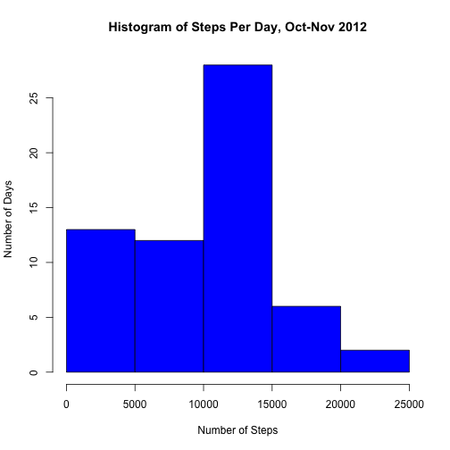
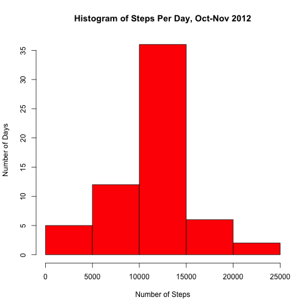
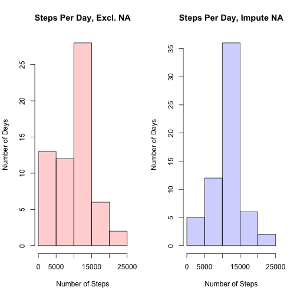
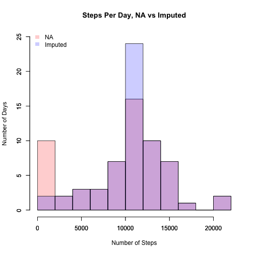
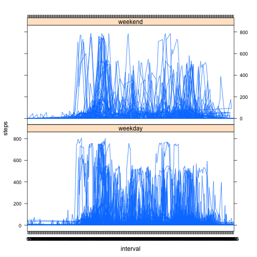

# Assignment  
This assignment will be described in multiple parts. You will need to write a report that answers the questions detailed below. Ultimately, you will need to complete the entire assignment in a single R markdown document that can be processed by knitr and be transformed into an HTML file.

Throughout your report make sure you always include the code that you used to generate the output you present. When writing code chunks in the R markdown document, always use echo = TRUE so that someone else will be able to read the code. This assignment will be evaluated via peer assessment so it is essential that your peer evaluators be able to review the code for your analysis.

For the plotting aspects of this assignment, feel free to use any plotting system in R (i.e., base, lattice, ggplot2)

Fork/clone the GitHub repository created for this assignment. You will submit this assignment by pushing your completed files into your forked repository on GitHub. The assignment submission will consist of the URL to your GitHub repository and the SHA-1 commit ID for your repository state.

NOTE: The GitHub repository also contains the dataset for the assignment so you do not have to download the data separately.

### Load the data

```r
if (!file.exists("activity.csv")) {
    unzip("repdata-data-activity.zip")
}
activity <- read.csv("activity.csv")
```

### Clean the data

```r
activity$date <- as.Date(activity$date)
activity$interval <- as.factor(activity$interval)
```

### What is mean total number of steps taken per day?
(For this part of the assignment, you can ignore the missing values in the dataset.)

### Make a histogram of the total number of steps taken each day

```r
library(plyr)
steps_per_day <- ddply(activity, .(date), summarise, sum = sum(steps, na.rm=T))
steps_per_day
```

```
##          date   sum
## 1  2012-10-01     0
## 2  2012-10-02   126
## 3  2012-10-03 11352
## 4  2012-10-04 12116
## 5  2012-10-05 13294
## 6  2012-10-06 15420
## 7  2012-10-07 11015
## 8  2012-10-08     0
## 9  2012-10-09 12811
## 10 2012-10-10  9900
## 11 2012-10-11 10304
## 12 2012-10-12 17382
## 13 2012-10-13 12426
## 14 2012-10-14 15098
## 15 2012-10-15 10139
## 16 2012-10-16 15084
## 17 2012-10-17 13452
## 18 2012-10-18 10056
## 19 2012-10-19 11829
## 20 2012-10-20 10395
## 21 2012-10-21  8821
## 22 2012-10-22 13460
## 23 2012-10-23  8918
## 24 2012-10-24  8355
## 25 2012-10-25  2492
## 26 2012-10-26  6778
## 27 2012-10-27 10119
## 28 2012-10-28 11458
## 29 2012-10-29  5018
## 30 2012-10-30  9819
## 31 2012-10-31 15414
## 32 2012-11-01     0
## 33 2012-11-02 10600
## 34 2012-11-03 10571
## 35 2012-11-04     0
## 36 2012-11-05 10439
## 37 2012-11-06  8334
## 38 2012-11-07 12883
## 39 2012-11-08  3219
## 40 2012-11-09     0
## 41 2012-11-10     0
## 42 2012-11-11 12608
## 43 2012-11-12 10765
## 44 2012-11-13  7336
## 45 2012-11-14     0
## 46 2012-11-15    41
## 47 2012-11-16  5441
## 48 2012-11-17 14339
## 49 2012-11-18 15110
## 50 2012-11-19  8841
## 51 2012-11-20  4472
## 52 2012-11-21 12787
## 53 2012-11-22 20427
## 54 2012-11-23 21194
## 55 2012-11-24 14478
## 56 2012-11-25 11834
## 57 2012-11-26 11162
## 58 2012-11-27 13646
## 59 2012-11-28 10183
## 60 2012-11-29  7047
## 61 2012-11-30     0
```

```r
hist(steps_per_day$sum, ylab="Number of Days", col="blue", xlab="Number of Steps", main="Histogram of Steps Per Day, Oct-Nov 2012")
```

 

### Calculate and report the mean of the total number of steps taken per day

```r
mean(steps_per_day$sum)
```

```
## [1] 9354.23
```

### Calculate and report the median of the total number of steps taken per day

```r
median(steps_per_day$sum)
```

```
## [1] 10395
```

### What is the average daily activity pattern?
Make a time series plot (i.e. type = "l") of the 5-minute interval (x-axis) and the average number of steps taken, averaged across all days (y-axis).

```r
library(ggplot2)
steps_per_interval <- ddply(activity, .(interval), summarise, sum = sum(steps, na.rm=T))
p <- ggplot(steps_per_interval, aes(x=interval, y=sum, group=1)) 
p + geom_line() + labs(title = "Average Steps per Day by 5-min Intervals, Oct-Nov 2012") + labs(x = "5-minute Intervals", y = "Average Number of Steps")
```

 

### Which 5-minute interval, on average across all the days in the dataset, contains the maximum number of steps?

```r
steps_per_interval[ which(steps_per_interval$sum==(max(steps_per_interval$sum))), ]
```

```
##     interval   sum
## 104      835 10927
```

### Imputing missing values
Note that there are a number of days/intervals where there are missing values (coded as NA). The presence of missing days may introduce bias into some calculations or summaries of the data. Calculate and report the total number of missing values in the dataset.

```r
NA_values <- activity[!complete.cases(activity),]
nrow(NA_values)
```

```
## [1] 2304
```

### Devise a strategy for filling in all of the missing values in the dataset. 
The strategy does not need to be sophisticated. For example, you could use the mean/median for that day, or the mean for that 5-minute interval, etc. Create a new dataset that is equal to the original dataset but with the missing data filled in.

```r
# Calculate the mean for each interval
interval_mean <- ddply(activity, .(interval), summarise, mean = mean(steps, na.rm=T))
# Add the interval mean as a new variable to the activity dataset 
activity_with_interval_mean <- join(activity, interval_mean)
```

```
## Joining by: interval
```

```r
# Write function that will replace NA values with the interval mean
replace_NA <- function(dataset, variable, replacement) {
    for (i in 1:nrow(dataset)) {
        if (is.na(dataset[i, variable])) {
                dataset[i, variable] <- dataset[i, replacement]
        }
    }
    dataset
}
# Run the function on the dataset
complete_activity <- replace_NA(activity_with_interval_mean, variable=1, replacement=4)
complete_activity <- complete_activity[, -4]
head(complete_activity)
```

```
##       steps       date interval
## 1 1.7169811 2012-10-01        0
## 2 0.3396226 2012-10-01        5
## 3 0.1320755 2012-10-01       10
## 4 0.1509434 2012-10-01       15
## 5 0.0754717 2012-10-01       20
## 6 2.0943396 2012-10-01       25
```

### Make a histogram of the total number of steps taken each day and calculate and report the mean and median total number of steps taken per day. 

```r
complete_steps_per_day <- ddply(complete_activity, .(date), summarise, sum = sum(steps))
complete_steps_per_day$sum <- round(complete_steps_per_day$sum)
hist(complete_steps_per_day$sum, ylab="Number of Days", col="red", xlab="Number of Steps", main="Histogram of Steps Per Day, Oct-Nov 2012")
```

 

### Do these values differ from the estimates from the first part of the assignment? 
Mean comparison

```r
mean(steps_per_day$sum)
```

```
## [1] 9354.23
```

```r
mean(complete_steps_per_day$sum)
```

```
## [1] 10766.16
```

Median comparison

```r
median(steps_per_day$sum)
```

```
## [1] 10395
```

```r
median(complete_steps_per_day$sum)
```

```
## [1] 10766
```

### What is the impact of imputing missing data on the estimates of the total daily number of steps?
Separate histograms

```r
par(mfrow=c(1,2)) 
hist(steps_per_day$sum, ylab="Number of Days", col=rgb(1,0,0,0.2), xlab="Number of Steps", main="Steps Per Day, Excl. NA")
hist(complete_steps_per_day$sum, ylab="Number of Days", col=rgb(0,0,1,0.2), xlab="Number of Steps", main="Steps Per Day, Impute NA")
```

 

Overlapping histograms

```r
hist(steps_per_day$sum,ylim=c(0,25),breaks=10,col=rgb(1,0,0,0.2), ylab="Number of Days", xlab="Number of Steps", main="Steps Per Day, NA vs Imputed")
par(new=TRUE)
hist(complete_steps_per_day$sum,ylim=c(0,25),breaks=10,col=rgb(0,0,1,0.2),main="",xlab="",ylab="")
legend('topleft',c('NA','Imputed'),
       fill = c(rgb(1,0,0,0.2), rgb(0,0,1,0.2)), bty = 'n',
       border = NA)
```

 


## Are there differences in activity patterns between weekdays and weekends?
For this part the weekdays() function may be of some help here. Use the dataset with the filled-in missing values for this part. Create a new factor variable in the dataset with two levels – “weekday” and “weekend”, indicating whether a given date is a weekday or weekend day.

```r
library(timeDate)
complete_activity$day_of_week <- ifelse(isWeekday(complete_steps_per_day$date)==TRUE, "weekday", "weekend")
```

### Make a panel plot containing a time series plot (i.e. type = "l") of the 5-minute interval (x-axis) and the average number of steps taken, averaged across all weekday days or weekend days (y-axis).

```r
library(lattice)
xyplot(steps ~ interval | day_of_week, layout = c(1, 2), data=complete_activity, type="l")
```

 


